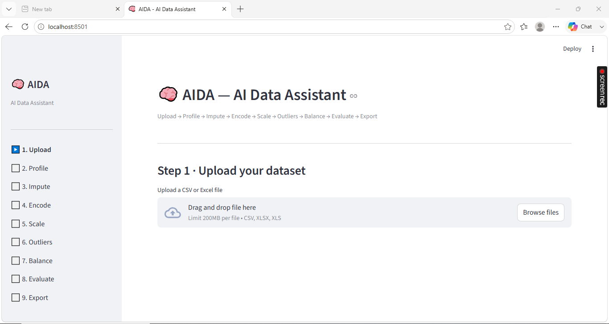
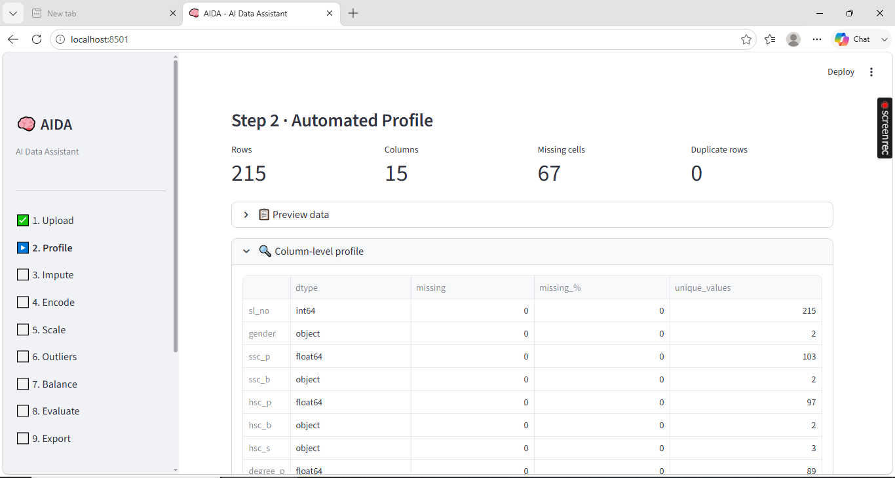
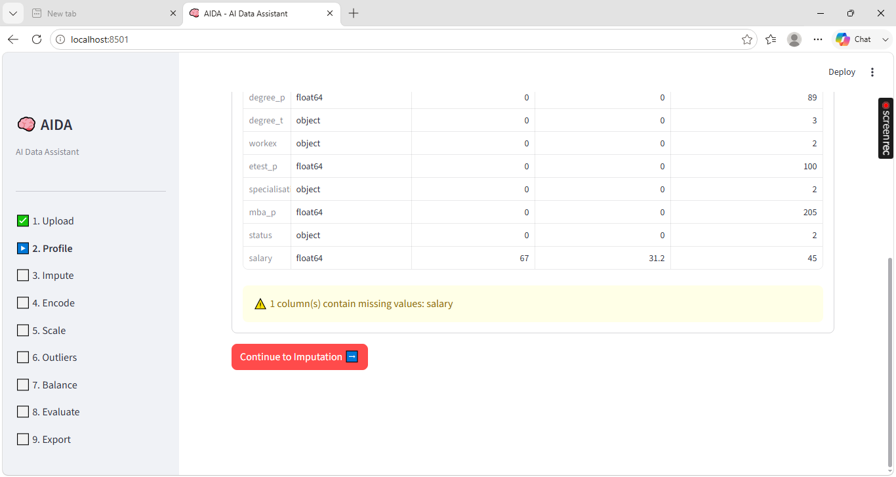
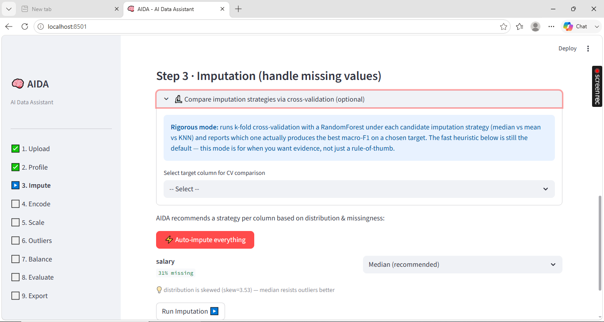
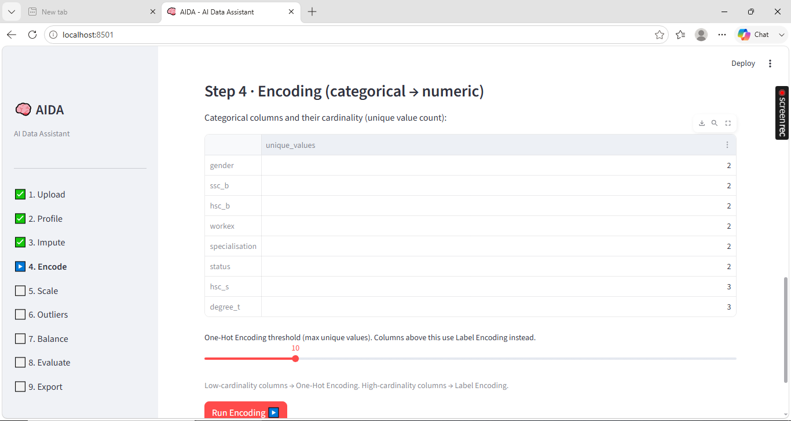
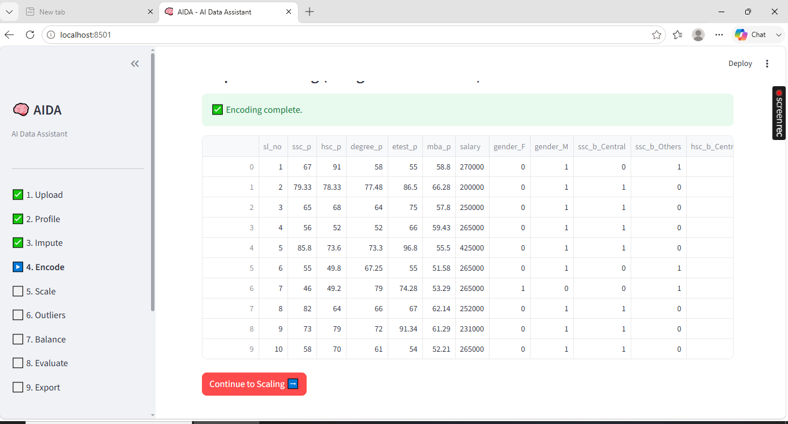
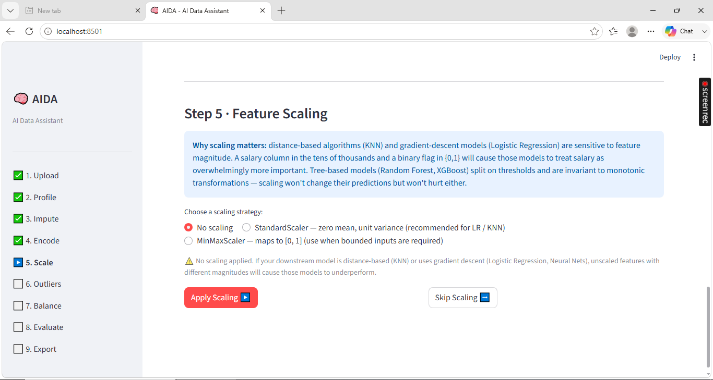
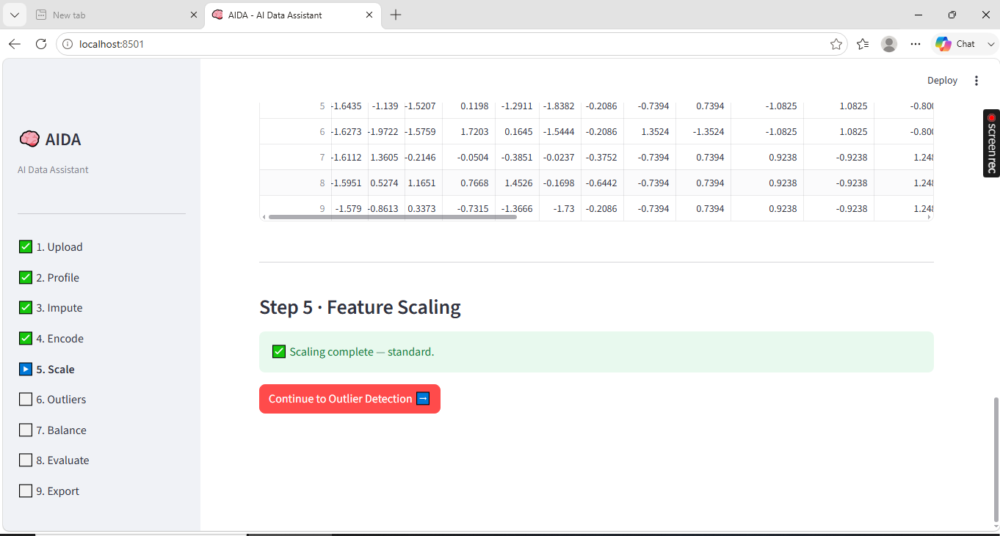
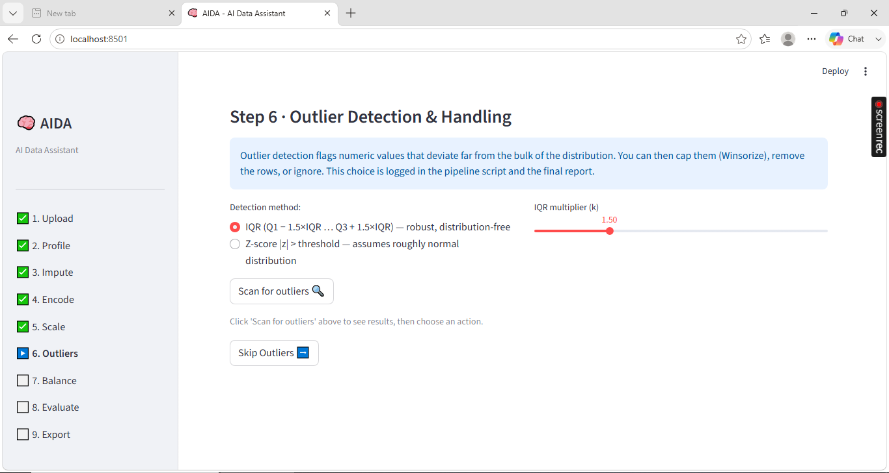
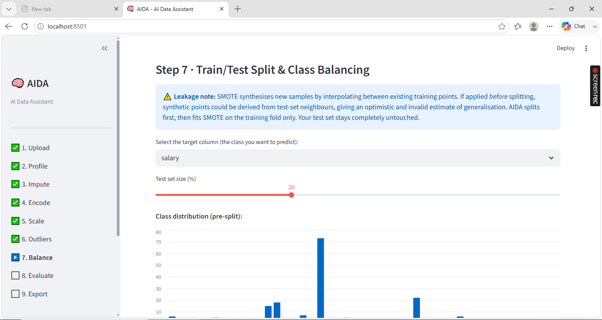

# AIDA — AI Data Assistant

A guided ML preprocessing pipeline: **Upload → Profile → Impute → Encode → Scale → Outliers → Balance → Evaluate → Export**

---

## Why this exists

Most preprocessing tools either (a) do everything automatically with no explanation, or (b) make you write all the code yourself with no guidance. AIDA sits in the middle: it recommends preprocessing choices based on what it sees in *your* data, explains the reasoning behind each recommendation, and then — critically — *proves* whether those choices helped by training a baseline model before and after preprocessing and showing you the difference.

The goal is a tool that teaches you the *why* as it goes, not just the *what*.

---

## What it does

| Step | What happens |
|------|-------------|
| **1. Upload** | CSV or Excel file |
| **2. Profile** | Shape, dtypes, missingness, cardinality — all at a glance |
| **3. Impute** | Per-column recommendation (Median / Mean / KNN) based on skew and missingness. Optional rigorous mode: cross-validates all three strategies and shows which one actually produces the best model score |
| **4. Encode** | One-Hot for low-cardinality, Label Encoding for high-cardinality (threshold is adjustable) |
| **5. Scale** | StandardScaler, MinMaxScaler, or none — with a model-aware justification explaining *why* scaling matters (or doesn't) for the chosen downstream model |
| **6. Outliers** | IQR or Z-score detection; cap, remove, or ignore with logged choice |
| **7. Balance** | **Train/test split first**, then SMOTE on training data only. The leakage risk is explained in the UI. |
| **8. Evaluate** | Before/after baseline model comparison with Precision, Recall, F1, and ROC-AUC |
| **9. Export** | Clean CSV + reproducible Python script + downloadable Markdown report |

---

## Design decisions

### 1. Train/test split before SMOTE — avoiding synthetic leakage

**The problem:** SMOTE synthesises new minority-class samples by interpolating between existing data points (finding k-nearest neighbours, then drawing a new point along the line between them). If you run SMOTE on the *full* dataset and then split, some synthetic samples will have been derived using test-set points as neighbours. Those test-set points have effectively influenced the training data. Your evaluation metrics will be optimistic and invalid.

**What AIDA does:** It splits first (stratified, so class proportions are preserved in both folds), then fits SMOTE on `X_train` only. The test set is never seen by the SMOTE process. This is enforced in `pipeline_utils.apply_smote_train_only`, which takes `X_train, y_train` as arguments — it cannot operate on the full dataset.

**The same principle applies to scaling.** `StandardScaler` computes mean and standard deviation from the data it's fit on. If fit on the full dataset, it encodes test-set distribution information into the scale parameters. AIDA fits all scalers on `X_train` only.

**Why this matters in interviews:** "Did you avoid data leakage?" is one of the most common screening questions for ML roles. Being able to point at a tool that enforces leakage prevention at the API level — not just as a best-practice note in a notebook — is a stronger signal than describing it abstractly.

---

### 2. Before/after model evaluation (not just accuracy)

**The problem with accuracy:** On an imbalanced dataset with 90% majority class, a model that *always predicts the majority class* achieves 90% accuracy — and zero recall on the minority class. Accuracy hides this completely.

**What AIDA reports instead:**
- **Precision** — of the predictions labelled as class X, how many were actually class X?
- **Recall** — of the actual class-X samples, how many did the model find?
- **F1** — harmonic mean of precision and recall (penalises extreme imbalances between the two)
- **ROC-AUC** — probability that the model ranks a randomly chosen positive above a randomly chosen negative; 0.5 is random, 1.0 is perfect

All metrics are **macro-averaged**, meaning each class contributes equally regardless of frequency. This makes minority-class performance visible instead of buried in the majority.

**The baseline model selection heuristic:**
- Binary target + ≥200 samples → `LogisticRegression` (interpretable, fast, well-understood)
- Multiclass or small dataset → `RandomForestClassifier` (handles multiclass natively, no convergence issues, less sensitive to scale)

This isn't arbitrary — the UI explains the choice so you can defend it.

**The before/after comparison** uses the same test set for both evaluations (the raw baseline uses a separate split of the *raw* data). This lets you see the actual delta: did imputation/encoding/balancing help, hurt, or make no difference?

---

### 3. Imputation: heuristic-first, cross-validated on demand

The default imputation recommendation is a transparent heuristic:
- **High missingness (>35%)** → Median (KNN degrades badly with many missing neighbours; mean gets pulled by outliers)
- **Skewed distribution (|skew| > 1.0)** → Median (robust to extreme values)
- **Roughly symmetric + low missingness** → Mean

The "Compare strategies" mode runs 5-fold cross-validation with a Random Forest under each strategy and reports which one actually produces the best macro-F1. This is not a guess — it's measured. The heuristic is the default (fast, requires no target column selection upfront); the CV mode is for when you want evidence.

---

### 4. Scaling is model-aware

The UI explains whether scaling is necessary based on what downstream model is being used:
- **Tree-based models** (Random Forest, Decision Trees): split on thresholds, invariant to monotonic feature transformations. Scaling is irrelevant.
- **Logistic Regression / KNN**: gradient descent and distance metrics both assume features are on comparable scales. A salary column and a binary flag on the same model without scaling will cause the salary to dominate the gradient and the distance calculation.

This makes the interaction between preprocessing and model choice explicit — which is what separates "I applied StandardScaler because sklearn tutorials do it" from "I applied StandardScaler because my model uses Euclidean distance."

---

## Screenshots












---

## Repository layout

```
app.py              # Streamlit UI layer — thin, readable, no ML logic
pipeline_utils.py   # All core ML/DS logic — pure functions, independently testable
test_app.py         # pytest unit tests for core functions
requirements.txt    # Pinned dependencies
```

The split between `app.py` and `pipeline_utils.py` is deliberate: it means the ML logic can be unit-tested without importing Streamlit (which has a global `st` state that makes testing awkward). Any function in `pipeline_utils.py` can be called from a notebook, a script, or a test without touching the UI.

---

## Run locally

```bash
pip install -r requirements.txt
streamlit run app.py
```

## Run tests

```bash
pip install pytest
pytest test_app.py -v
```

Notable tests:
- `TestApplySmoteTrainOnly::test_test_set_is_unchanged` — proves SMOTE doesn't touch the test set (leakage prevention test)
- `TestApplyScaling::test_scaler_fit_on_train_only` — proves the scaler is fit on training data only
- `TestRecommendNumericStrategy` — covers edge cases (all-missing, too-few-observations, skewed vs symmetric)

---

## Use [Live App](https://aida.streamlit.app)

---

## Export artifacts

AIDA produces three downloadable files:

| File | Contents |
|------|----------|
| `aida_cleaned_*.csv` | The processed DataFrame (training fold after SMOTE) |
| `aida_pipeline.py` | Standalone Python script reproducing every transformation with your actual choices baked in |
| `aida_report.md` | Data Quality & Modeling Report — profile summary, missingness handling, encoding choices, class balance before/after, before/after model comparison table, outlier handling log |
| `aida_test_set.csv` | The untouched test fold — held out for final evaluation |

The Markdown report is the artifact to include in a portfolio or CV writeup. It answers: "did your preprocessing actually help?" with numbers, not claims.

---

## Notes

- State is held in `st.session_state` only — nothing is written to disk server-side, safe for Streamlit Cloud's shared infrastructure.
- The generated pipeline script is built from a log of the actual operations run (not a template), so two different uploads with different choices produce two different scripts.
- "Start Over" in the sidebar fully resets all state.
- SMOTE requires all features to be numeric — that's why encoding is enforced as an earlier step. If you skip encoding and try SMOTE on remaining text columns, the app tells you exactly which columns are still non-numeric.
